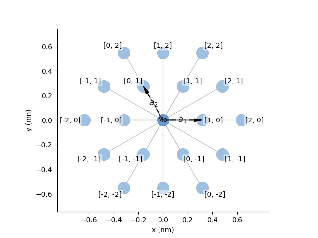
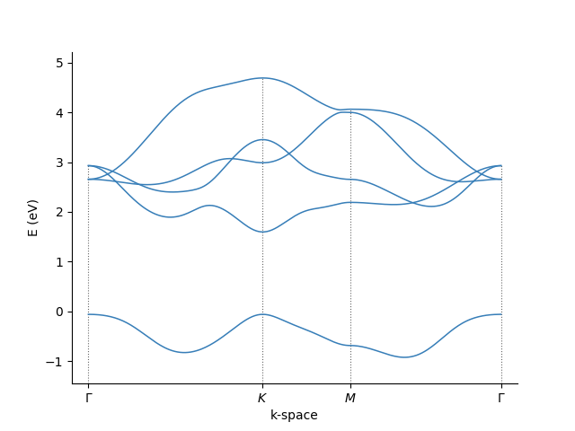

## TMDybinding


**TMDybinding** is an open-source Python module for [pybinding].
This package contains the basic lattices in the [pybinding]
[`pb.Lattice()`](https://docs.pybinding.site/en/stable/_api/pybinding.Lattice.html) format to create tight-binding
models for TMDs.


## Installation
Installation is simple, just run
```
pip install tmdybinding
```
The installation only contains the source files in the PyPi repository.
This code does not need any compilation, this source can be used immediately in combination with [pybinding].

!!! tip "Installing pybinding"
    
    Additionally, you might want to install the latest development version of pybinding.
    This latest version has additional tools to inspect the sublattices or orbitals, and analyze the wavefunction:
    ```
    pip install -i https://test.pypi.org/simple/ pybinding
    ```

## Usage
### Making a lattice
To use TMDybinding, first follow the tutorial at [pybinding].

In TMDybinding, a [`pb.Lattice()`](https://docs.pybinding.site/en/stable/_api/pybinding.Lattice.html) is created for a specific TMD lattice.
You need to make specific choices for the lattice you want to obtain:

- **params** the parameters to use with the model
- **soc** select if you want to include the spin orbit coupling (SOC)
- **material** select the material you want to use (depends on the parameters of choice)
- **lat4** make a square unit cell (doubled to obtain the armchair direction)

For example, you can take the parameters from [G-B. Liu](https://doi.org/10.1103/PhysRevB.88.085433)
for `"MoS2"` in a hexagonal lattice without SOC, for the specific model used in their publication for the
sixth-nearest neighbour hopping (in their paper this is described as the third-nearest neighbour hopping, as they only
consider the metal `d`-orbitals):
```python
import tmdybinding as tmdy

# make the lattice object
lat = tmdy.TmdNN256Me(params=tmdy.liu6["MoS2"]).lattice()

# make a figure with the lattice
lat.plot()
```
<div>
  <figure>
    
    <figcaption>The lattice structure for the TMD.</figcaption>
  </figure>
</div>

!!! warning "**Selecting parameters and classes**"

    Please use the combinations of class and parameters as given in [Documentation/Possible parameters](documentation/parameters.md).

### Using the lattice

Below is a small example of how to use the code for the 5-band model from Liu/Wu:
```python
import pybinding as pb
import tmdybinding as tmdy

# get the parameters
lat = tmdy.TmdNN256Meo(params=tmdy.wu["MoS2"]).lattice()
model = pb.Model(lat, pb.translational_symmetry())
bz = lat.brillouin_zone()
bands = pb.solver.lapack(model).calc_bands(
    bz[3] * 0, bz[3], (bz[3] + bz[4]) / 2, bz[3] * 0
)
bands.plot(point_labels=[r"$\Gamma$", "$K$", "$M$", r"$\Gamma$"])
```
<div>
  <figure>
    
    <figcaption>The band structure for the TMD.</figcaption>
  </figure>
</div>

Further documentation is coming soon.
Made by [Bert Jorissen].

## Citing
If you used this code in your research, please cite the following article:
[B. Jorissen, L. Covaci, B. Partoens, SciPost Phys. Core 7, 004 (2024)](https://doi.org/10.21468/SciPostPhysCore.7.1.004).

[Bert Jorissen]: https://bertjorissen.be
[pybinding]: https://pybinding.site